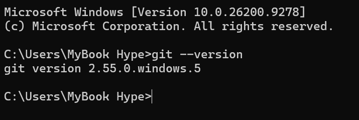
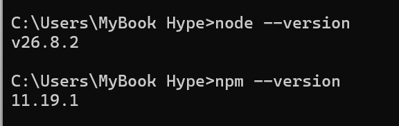
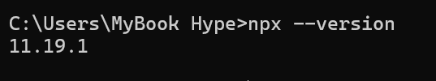
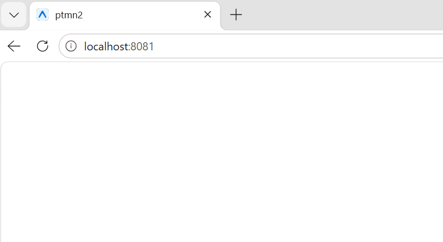

# Praktikum Mentiapkan Memulai Pemrograman Mobile dengan React Native

## Tujuan Pembelajaran
Setelah menyelesaikan modul praktikum ini, mahasiswa diharapkan mampu:
- Menginstal Git dan Github
- Menginstal Node.js dan NPM
- Menginstal Expo CLI
- Membuat project React Native
- Menjalankan project React Nnpx create-expo-app ptmn2 --template blankative

1. Install Git di local
    - Unduh dan instal Git via 
    - Verifikasi Git https://git-scm.com/install/windows
    

2. Install Node.js
    - Unduh dan install Node JS via https://nodejs.org/en/download/
    - Verifikasi Node JS 
    

3. Memulai Projek dengan Framework Expo
    - Buka terminal pada code editor
    - Pastikan aktif di directory yang dituju
    - Ketikan (npx create-expo-app@latest ptmn2 --template blank)
    - Tunggu hingga proses install selesai
    - Projek selesai
   

4. Menjalankan Projek React Native
    - Masuk ke directory projek (cd ptmn2)
    - Jalankan projek (npx expo start)
    - Scan QR code dengan aplikasi Expo Go
    - Jika ingin run emulator di web ketik w
    - Di terminal "npx expo install react-dom react-native-web"
    - npx expo start --web
    

5. LATIHAN PERTEMUAN_2
    - Tambahkan text berupa
    - Nama Lengkap
    - Tempat Tanggal Lahir
    - Cita-cita
    - Rencana Hidup
    
