# Laporan praktikum 4: Navigation in react native

langkah 1: menginstal Depedensi dan Library yang dibutuhkan untuk membuat Navigasi
1. install (npm instal @react-navigation/native)
   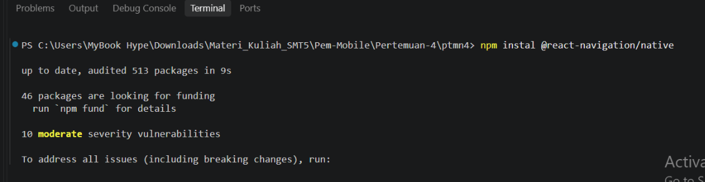
2. install DependensiNative (npx expo install react-native-screens react-native-safe-area-context react-native-gesture-handler react-native-reanimated)
   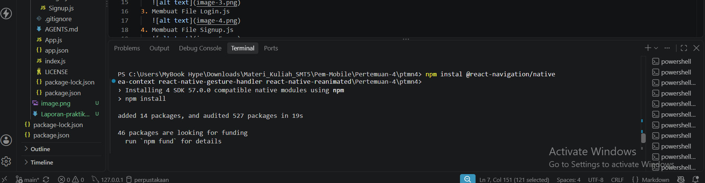

PRAKTIKUM 1: Stack Navigation
1. instal library untuk stack Navigasi (npm install @react-navigation/native-stack)
   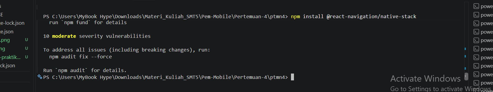
2. Membuat Folder screens
   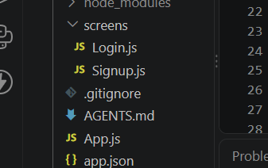
3. Membuat File Login.js
   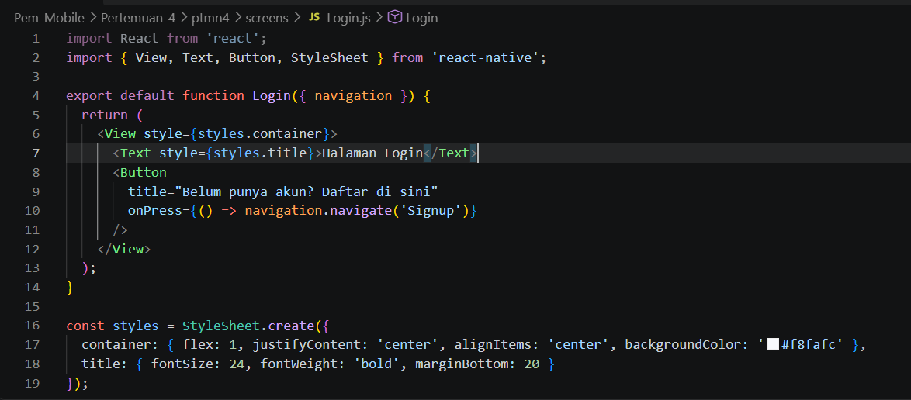
4. Membuat File Signup.js
   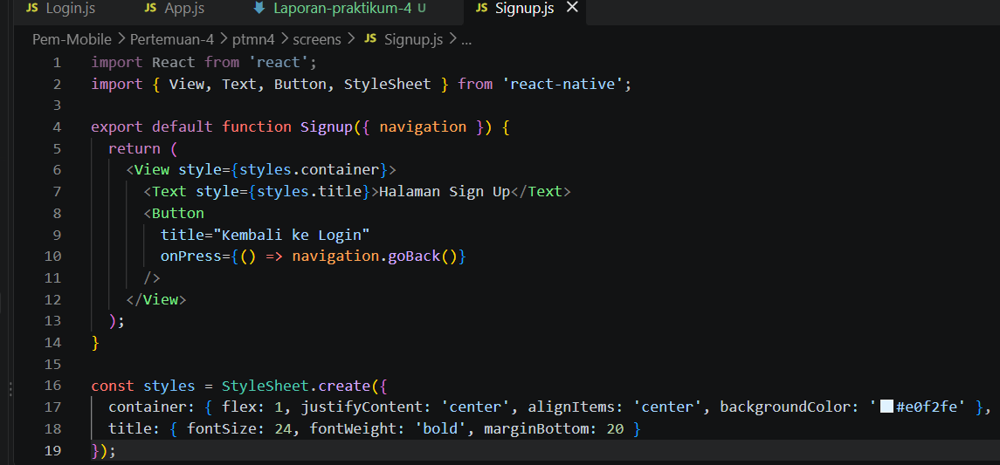
5. Menambahkan Stack Navigation pada App.js
   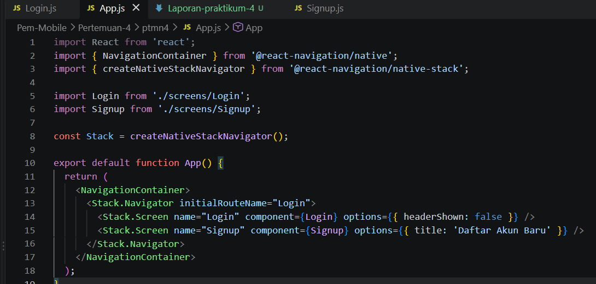
6. Menjalankan dan Menguji Stack Navigation
   

PRAKTIKUM 2: Bottom Tab Navigation
1. Install Library Bottom Tab Navigation (npm install @react-navigation/bottom-tabs)
   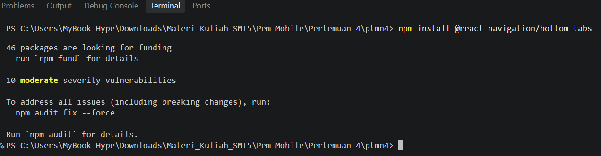
2. Membuat file HomeScreen.js
   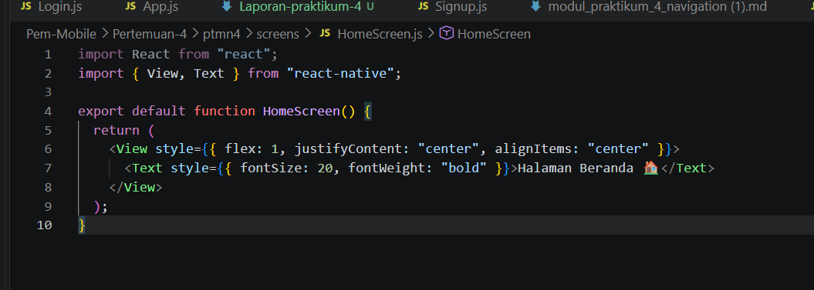
3. Membuat file ProfileScreen.js
   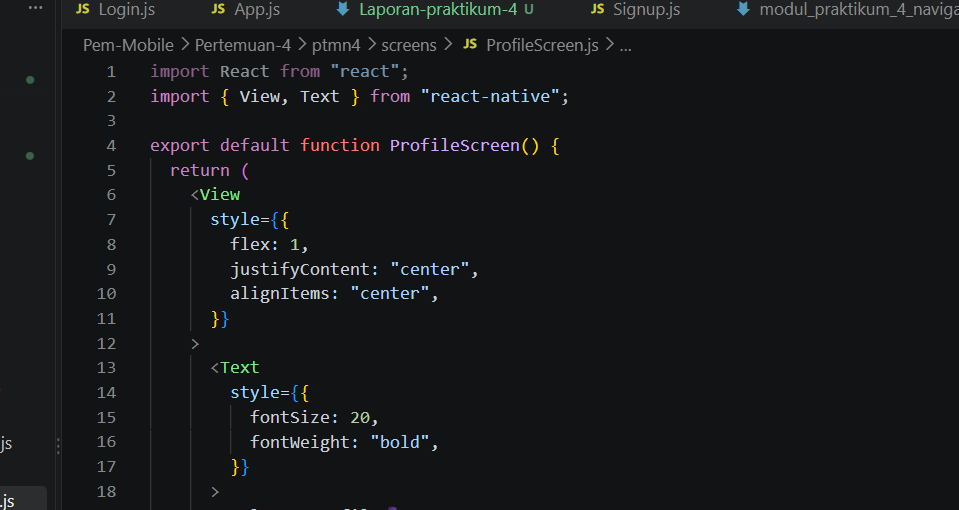
4. Mengatur Bottom Tab pada App.js
   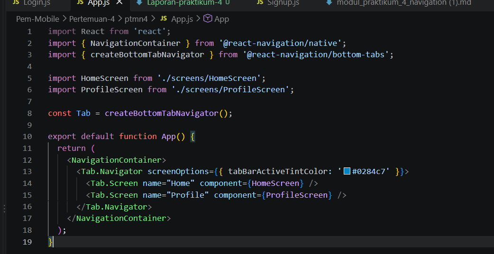
5. menjalankan dan Menguji Bottom Tab Navigation
   

PRAKTIKUM 3: Drawer Navigation
1. Instalasi Pustaka Drawer (npm install @react-navigation/drawer)
   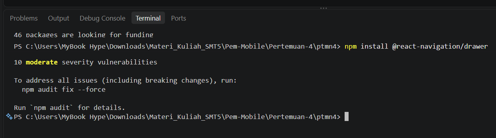
2. Konfigurasi Drawer di `App.js`
   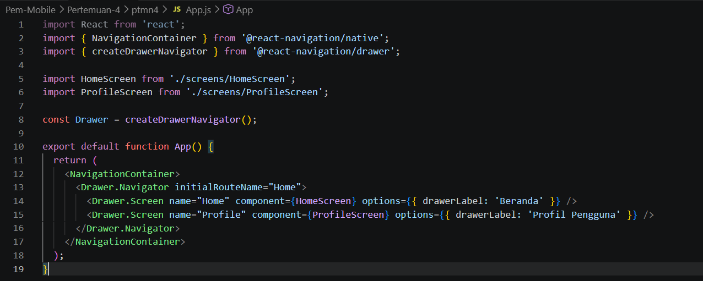
3. Menguji Drawer Navigation
   
